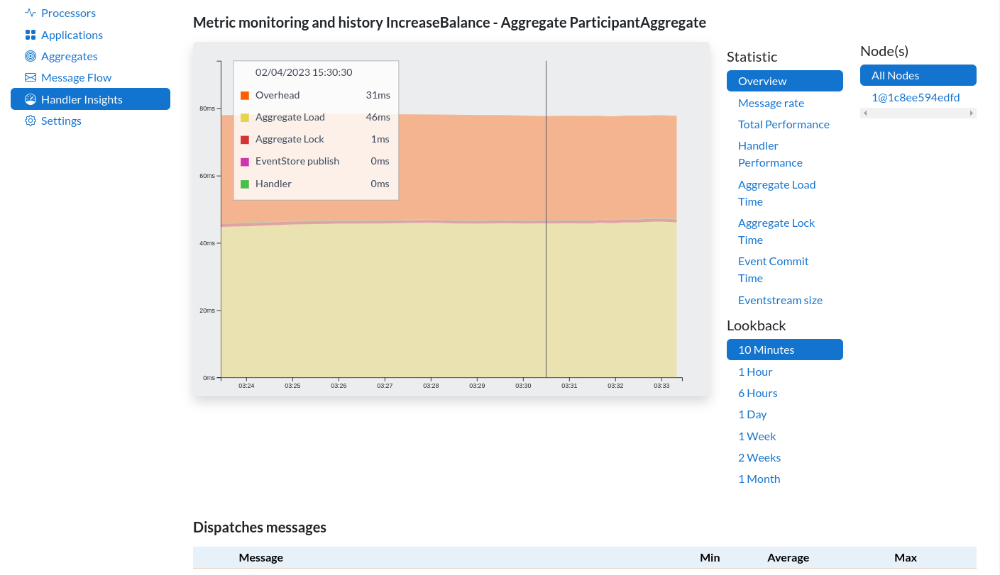

# Inspector Axon

Inspector Axon superpowers your Axon Framework application with advanced monitoring and enabling easy access to actions
within the framework.

This repository contains the Open-Source connectors that your application will use through maven dependencies.
For actual configuration, please consult the setup instructions that will be provided by Inspector Axon itself.

[You can visit Inspector Axon here.](https://inspector.axoniq.io)

Built with ❤ by the Axon Framework team

## Spring Boot Starter

### application properties

* `axon.inspector.enabled` - allows disabling the autoconfiguration via `axon.inspector.enabled=false`, default: `true`
* `axon.inspector.dlq-enabled` - allows access to the messages in the DLQ, default: `true`

## Data sent to AxonIQ

Inspector Axon is an [AxonIQ](https://axoniq.io) SaaS product. Your application will periodically or upon request send
information to the servers of AxonIQ. Please check our [legal documentation](https://inspector.axoniq.io/legal) for the
measures we implemented to protect your data.

The following data will be sent to the servers of AxonIQ:

- Event processor information
  - Name, latency, status, position
  - Occurs every 2 seconds
- Handler statistics
  - Message names and names of handling components
  - Statistics such as latency, throughput and error rates
  - Correlation between messages and different handlers
  - Occurs every 20 seconds
- Dead Letter Information
  - Contains message name, error information and event payload
  - Occurs upon user request
  - Can be disabled by 